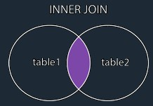
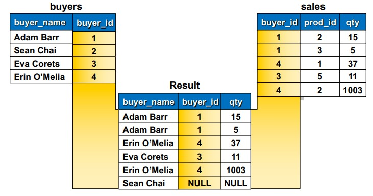
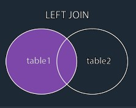
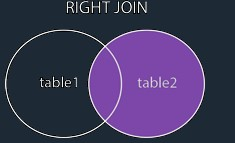
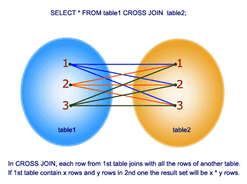
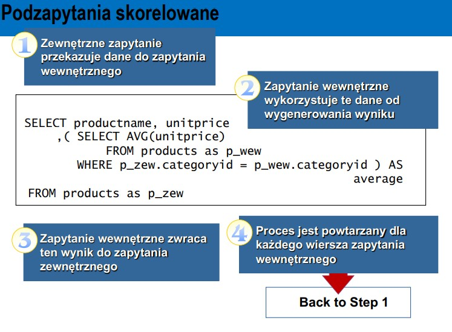

# SQL Podstawy

## Podstawowa skladnia
```SQL
SELECT [ALL | DISTINCT] <select_list or column> 
FROM {<table_source>} [,…n] 
WHERE <search_condition>;  // w warunkach uwazac na wielkosc liter 
```
Operatory porównań: 
- =
- \>
- <
- \>=
- <=
- <> to jest operator negacji
  
Przykład:
```SQL
USE Northwind 
SELECT ProductName, UnitPrice 
FROM Products 
WHERE UnitPrice >= 20 AND UnitPrice <= 30;
```
Porównywanie napisów: 
- LIKE
- NOT LIKE

Operator **LIKE** – porównywanie ze wzorcem

**LIKE** tylko dla danych typu: **char, nchar, varchar, nvarchar, binary, varbinary, smalldatetime, datetime**, oraz pod pewnymi założeniami dla **text, ntext, image**

Znak specjalny Opis:
- \% 0 lub więcej znaków
- \_ pojedynczy znak
- \[ \] pojedynczy znak z zakresu
- \[\^\] pojedynczy znak z poza zakresu

Wzorce LIKE:
- LIKE ‘BR%’ napisy zaczynające się od BR
- LIKE ‘Br%’ napisy zaczynające się od Br
- LIKE ‘%een’ napisy kończące się na een
- LIKE ‘%en%’ napisy mające w środku en
- LIKE ‘_en’ pierwsza litera dowolna a następnie en
- LIKE ‘[CK]%’ pierwsza litera C lub K
- LIKE ‘[S-V]%’ pierwsza litera S do V
- LIKE ‘M[^c]%’ pierwsza litera M druga litera różna od c


Operatory logiczne,łączenie warunków:
- AND
- OR

Przykład: 
```SQL
SELECT ProductName, UnitPrice 
FROM Ccustomers 
WHERE Country = 'France' OR Country = 'Spain';
```

Operator logiczny:  
- NOT negacja

Zakres wartości: 
- BETWEEN
- NOT BETWEEN

Przykład:

```SQL
SELECT ProductName, UnitPrice 
FROM Products 
WHERE UnitPrice BETWEEN 20 AND 30;
```

Listy wartości: 
- IN
- NOT IN

Przykład: 
```SQL
SELECT ProductName, UnitPrice 
FROM Customers 
WHERE Country IN ('France', 'Spain');
```

Nieznane wartości: 
- IS NULL 
- IS NOT NULL

Przykład:
```SQL
SELECT companyname, fax 
FROM suppliers 
WHERE fax IS NULL;
```

## Zmienne oraz aliasy
Deklarowanie zmiennej i ustawianie jej wartosci:
```SQL
DECLARE @zmienna INT 

SET @zmienna = (SELECT CategoryID 
                FROM Categories 
                WHERE CategoryName = 'Meat/Poultry');
```

Do nadania nowej nazwy kolumnie itp stosujemy **AS**, przykład:
```SQL
USE northwind; -- to do wskazania z której bazy korzystamy 

SELECT orderid, unitprice * 1.05 AS NewUnitPrice 
FROM [order details];
```

Operacje na napisach: 
```SQL
SELECT firstname + ` ` + lastname AS imie_nazwisko 
FROM employees;
```

lub można za pomocą funkcji **CONCAT** złączyć dwie tabele: 

```SQL
SELECT SupplierID, CONCAT(Phone, ', ', Fax) AS PhoneWithFax 
FROM Suppliers;
```

## ORDER BY 

The ORDER BY keyword is used to sort the result-set in **ascending** or **descending** order. (ascending - rosnącym, descending - malejącym)

The ORDER BY keyword sorts the records in ascending order by default. To sort the records in descending order, use the DESC keyword.

```SQL
SELECT column1, column2, ... 
FROM table_name 
ORDER BY column1, column2, ... ASC|DESC;
```

## Eliminacja duplikatów w wynikowym zbiorze

Przykład **DISTINCT**:

```SQL
SELECT DISTINCT Country 
FROM suppliers 
ORDER BY country;
```
## Ciekawe zadanko, part 1
**Polecenie:  Napisz polecenie, które oblicza wartość każdej pozycji zamówienia o numerze 10250**
```SQL
-- Tu jeszcze trzeba uwzglednic rabat procentowy
-- ROUND i CAST funkcje do zaokrąglania

SELECT ROUND(UnitPrice * Quantity - (1 - Discount), 2) AS 'Value of order' 
FROM [Order Details] 
WHERE OrderID = 10250;

SELECT CAST(UnitPrice * Quantity - (1 - Discount) AS DECIMAL(10, 2)) 
FROM [Order Details] 
WHERE OrderID = 10250; -- wynik z przecinkami
```

## Grupowanie danych

- Ograniczanie rozmiaru zbioru wynikowego (TOP n)
- Użycie funkcji agregujących
- Grupowanie danych - klauzula GROUP BY 
- Generowanie wartości zagregowanych 

### Wyświetlanie początkowych wierszy

- Wyświetlanie tylko pierwszych n wierszy zbioru wynikowego
```SQL
SELECT TOP 5 OrderID, ProductID, Quantity 
FROM [Order Details] 
ORDER BY Quantity DESC; -- wezmie pierwsze dwa a później 3 dowolne,
-- jeżeli elementy nie są inne to może zwrócić losowo 
```
- Określenie zakresu wartości w klazuli ORDER BY 
- fraza WITH TIES powoduje, że zwracane są dodatkowo 
wszystkie elementy o wartościach takich jak element ostatni
```SQL
SELECT TOP 5 WITH TIES OrderID, ProductID, Quantity 
FROM [Order Details]
ORDER BY Quantity DESC; 
```
Czyli zwróci dodatkowo 5 elementów takich jak ostatni element. Np ostatni to wartość 120, więc kolejne 5 bedzie miało wartość 120.

## Funkcje agregujące

| Funkcja agregująca  | Opis                            |
|---------------------|---------------------------------|
| AVG                 | Średnia wartości w wyrażeniu numerycznym    | 
| COUNT | Liczba wartości w wyrażeniu                     |
| COUNT (*) | Liczba wybranych wierszy    |
| MAX | Największa wartość w wyrażeniu    |
| MIN | Najmniejsza wartość w wyrażeniu   |
| SUM | Totalna wartość w wyrażeniu numerycznym   |
| STDEV | Statystyczne odchylenie wszystkich wartości |
| STDEVP | Statystyczne odchylenie dla popularcji |
| VAR | Statystyczna wariancja dla wszystkich wartości    |
| VARP | Statystyczna wariancja dla wszystkich wartości w populacji   |

## Funkcja COUNT

Zlicza nam liczbę wierszy. Użyteczne na przykład do liczenia wierszy spełniający jakiś warunek

```SQL
SELECT COUNT(*) AS 'Number of rows' 
FROM Employees;
```

## GROUP BY 

The **GROUP BY** statement groups rows that have the same values into summary rows, like "find the number of customers in each country".

The **GROUP BY** statement is often used with aggregate functions **(COUNT(), MAX(), MIN(), SUM(), AVG())** to group the result-set by one or more columns.

```SQL
SELECT column_name(s)
FROM table_name
WHERE condition
GROUP BY column_name(s)
ORDER BY column_name(s);
```

Przykład (pokazujący bardziej, że w SELECT jak i w ORDER BY musi być COUNT): 
```SQL
SELECT COUNT(CustomerID), Country
FROM Customers
GROUP BY Country
ORDER BY COUNT(CustomerID) DESC;
```

## GROUP BY z klauzurą HAVING

The **HAVING** clause was added to SQL because the **WHERE** keyword cannot be used with aggregate functions.

```SQL
SELECT column_name(s)
FROM table_name
WHERE condition
GROUP BY column_name(s)
HAVING condition
ORDER BY column_name(s);
```

Example:
```SQL
SELECT COUNT(CustomerID), Country
FROM Customers
GROUP BY Country
HAVING COUNT(CustomerID) > 5
ORDER BY COUNT(CustomerID) DESC;
```

## ROLL UP 

**ROLLUP** rozszerza funkcjonalność klauzuli **GROUP BY**, o możliwość tworzenia tzw. kostek analitycznych połówkowych. Funkcja ta, przyjmuje jako parametry, analogicznie jak w zwykłym grupowaniu, atrybuty (nazwy kolumny) tabel wejściowych lub ich przekształcenia.

Przykład: 
```txt
Chcemy utworzyć raport, przedstawiający informacje 
o sprzedaży w latach 1997-1998 na kilku poziomach szczegółowości. 
Zagregowane dane na temat liczby zleceń, chcemy wyświetlić względem lat,
kwartałów i na koniec całościowo (jako najwyższy poziom agregacji).
```

```SQL
SELECT Year(Orderdate) AS Rok, DatePart(q, Orderdate) AS Q, count(OrderId) AS OrderQty
FROM dbo.Orders
WHERE YEAR(OrderDate) BETWEEN 1997 AND 1998
GROUP BY ROLLUP(YEAR(Orderdate), DATEPART(q, Orderdate)) -- musimy dopisywać 
-- tutaj to co w SELECT napisaliśmy 
```

Czyli podsumowując z wykórzystaniem tej funkcji mamy ilość zamówień dla konkretnych miesięcy, kwartałów, lat.

The **DATEPART()** function returns a specified part of a date.
- year, yyyy, yy = Year
- quarter, qq, q = Quarter
- month, mm, m = month
- dayofyear, dy, y = Day of the year
- day, dd, d = Day of the month
- week, ww, wk = Week
- weekday, dw, w = Weekday
- hour, hh = hour
- minute, mi, n = Minute
- second, ss, s = Second
- millisecond, ms = Millisecond
- microsecond, mcs = Microsecond
- nanosecond, ns = Nanosecond
- tzoffset, tz = Timezone offset
- iso_week, isowk, isoww = ISO week

## CUBE

Drugą funkcjonalnością wielokrotnego grupowanie to CUBE czyli pełna kostka analityczna. Stosujemy ją podobnie jak ROLLUP w poleceniu GROUP BY. Jej działanie to wykonanie grupowania we wszystkich wymiarach. Czyli jeśli podamy 3 atrybuty, to wykonanych zostanie 2^3 = 8 operacji.

```SQL
SELECT Year(Orderdate) AS Rok, DatePart(q,Orderdate)  AS Q, count(OrderId) AS OrderQty
FROM dbo.Orders
WHERE YEAR(OrderDate) BETWEEN 1997 AND 1998
GROUP BY CUBE(Year(Orderdate), DatePart(q,Orderdate))
```

## JOIN 
- A JOIN clause is used to combine rows from two or more tables, based on a related column between them,
  - Słowo kluczowe JOIN wskazuje, że tabele są łączone i 
określa w jaki sposób
  - Słowo kluczowe ON specyfikuje warunki połączenia
- Zapytanie do dwóch lub więcej tabel w celu wygenerowania 
pojedynczego zbioru wynikowego
  - Jako warunki połączenia wykorzystywane są przeważnie 
klucze główne i obce

### INNER JOIN 

The **INNER JOIN** keyword selects records that have matching values in both tables.



```SQL
SELECT Orders.OrderID, Customers.CustomerName, Orders.OrderDate
FROM Orders
INNER JOIN Customers ON Orders.CustomerID = Customers.CustomerID;
```
Napisz polecenie zwracające listę produktów zamawianych w dniu 1996-07-08
```SQL
SELECT orderdate, productname
FROM orders AS O
INNER JOIN [order details] AS OD
ON O.orderid = OD.orderid
INNER JOIN products AS P
ON OD.productid = P.productid
WHERE orderdate = ‘7/8/96’
```

Jak widać powyżej musimy przejść przez tabele Order Details żeby móc dostać się do Order Date. 

### OUTER JOIN

The **FULL OUTER JOIN** command returns all rows when there is a match in either left table or right table.

Czyli podsumowując będą to wszystkie wartości ze zbiorów powyżej.




### LEFT JOIN

The **LEFT JOIN** keyword returns all records from the left table (table1), and the matching records from the right table (table2). The result is 0 records from the right side, if there is no match.



```SQL
SELECT buyer_name, sales.buyer_id, qty
FROM buyers LEFT OUTER JOIN sales
ON buyers.buyer_id = sales.buyer_id
```


### RIGHT JOIN 

The **RIGHT JOIN** keyword returns all records from the right table (table2), and the matching records from the left table (table1). The result is 0 records from the left side, if there is no match.



```SQL
SELECT column_name(s)
FROM table1
RIGHT JOIN table2
ON table1.column_name = table2.column_name;
```

### CROSS JOIN

The SQL CROSS JOIN produces a result set which is the number of rows in the first table multiplied by the number of rows in the second table if no WHERE clause is used along with CROSS JOIN.This kind of result is called as Cartesian Product.

If WHERE clause is used with CROSS JOIN, it functions like an INNER JOIN.



```SQL
SELECT suppliers.companyname, shippers.companyname
FROM suppliers
CROSS JOIN shippers
```

### Łączenie tabeli samej ze sobą – self join
Napisz polecenie, które wyświetla listę wszystkich kupujących te 
same produkty.
```SQL
SELECT a.buyer_id AS buyer1, a.prod_id, b.buyer_id AS buyer2
FROM sales AS a
INNER JOIN sales AS b
ON a.prod_id = b.prod_id
```
Bez duplikatów. Nieważne czy damy <> lub znaki <, >, bo wynik jest ten sam. 

```SQL
SELECT a.buyer_id AS buyer1, a.prod_id, b.buyer_id AS buyer2
FROM sales AS a
INNER JOIN sales AS b ON a.prod_id = b.prod_id 
WHERE a.buyer_id <> b.buyer;
```

## Łączenie kilku zbiorów wynikowych 
- Użyj operatora UNION do tworzenia pojedynczego zbioru 
wynikowego z wielu zapytań
- Każde zapytanie musi mieć:
  - Zgodne typy danych
  - Taką samą liczbę kolumn – Taki sam porządek kolumn w select-list

```SQL
SELECT (firstname + ' ' + lastname) AS name, city, postalcode
FROM employees
UNION
SELECT companyname, city, postalcode
FROM customers;
```

Co w wyniku? Te same dane z dwóch różnych tabel. 

## Podzapytania do tabel 

W miejscu w którym możemy użyć nazwy tabeli, możemy użyć podzapytania
```SQL
SELECT T.orderid, T.customerid
FROM ( SELECT orderid, customerid FROM orders ) AS  T;
```

- Podzapytanie zwraca pojedynczą wartość
- Podzapytanie może być traktowane jako wyrażenie
  - może pojawić się na liście polecenia select
  - może się pojawić w warunku

```SQL
SELECT productname, price, ( SELECT AVG(price) FROM products) AS average,
price-(SELECT AVG(price) FROM products) AS difference
FROM products;
```

```SQL
SELECT productname, price, (SELECT AVG(unitprice) FROM products) AS average, unitprice-(SELECT AVG(price) FROM products) AS difference
FROM products
WHERE unitprice > ( SELECT AVG(unitprice) FROM products) 
```

### Podzapytanie skolerowane 



## Operatory EXISTS, NOT EXISTS

- Zewnętrzne zapytanie testuje wystąpienie (lub nie) zbioru wynikowego określonego przez zapytanie wewnętrzne
  - zapytanie wewnętrzne zwraca TRUE lub FALSE

```SQL
SELECT lastname, employeeid
FROM employees AS e
WHERE EXISTS (SELECT * FROM orders AS o WHERE e.employeeid = o.employeeid
AND o.orderdate = '9/5/97')
```

## Przydatne funkcje i informacje 

Data w Northwind jest odwrotna tzn. miesiąc jest pierwszy, a później jest dzień! 

- LOWER(text)
- UPPER(text)
- SUBSTRING(string, start, length)
- YEAR(date)
- MONTH(date)
- DAY(date)
- REPLACE(string, old_string, new_string)
- CONCAT(string1, string2, ...., string_n)

# KURS SQL

Krótki rzut oka na nomenklaturę podstawowych obiektów bazodanowe w różnych terminologiach. Od czystej teorii – do wdrożenia.

|Teoria relacyjna |	Model ER|	Relacyjne bazy	|Aplikacje|
|----|----|----|----|
Relacja	  |          Encja	 |   Tabela	  |      Klasa
Krotka	  |          Instancja	|Wiersz	   |     Instancja klasy (obiekt)
Atrybut	      |      Atrybut	 |   Kolumna	 |       Właściwość, atrybut
Dziedzina	   |     Dziedzina/Typ|	Typ danych	|Typ danych

## RELACYJNA BAZA DANYCH
Zgodnie z modelem E-R, to zbiór schematów RELACJI i ZWIĄZKÓW między nimi. 
Czyli struktur służących do przechowywania danych w ściśle zorganizowany sposób.

W praktyce będzie to zawsze zbiór tabel, w których przechowywane są dane. 
Ponadto tabele, posiadać będą określone powiązania (relacje) między sobą.

## RELACJA
W modelu E-R, to po prostu TABELA czyli struktura, przechowująca informacje o obiektach określonego typu. 
Używając języka programistów – KLASA obiektów określonego typu.

## ATRYBUT
Każda RELACJA jest opisana za pomocą zbioru ATRYBUTÓW. 
Warto dodać że ten zbiór powinien być zawsze minimalny, niezbędny do realizacji celów biznesowych.

ATRYBUT w praktyce, to nic innego jako KOLUMNA. Zatem tłumacząc na model relacyjny, każda TABELA opisana jest za pomocą zbioru KOLUMN. 
Każda KOLUMNA jest ściśle określona TYPEM DANYCH, czyli przechowuje wartości jednorodne, z określonej DZIEDZINY 

## SCHEMAT RELACJI
To po prostu jej definicja. Czyli informacja o strukturze, ATRYBUTACH które opisują daną RELACJĘ.

W praktyce będzie to struktura tabeli – czyli informacja przez jakie kolumny, jakiego typu jest ona opisana.

## KROTKA
To pojedynczy egzemplarz, czyli obiekt opisany wszystkimi ATRYBUTAMI danej RELACJI. KROTKA to nic innego jak WIERSZ czy REKORD. 
W języku programistów możemy mówić o EGZEMPLARZU danej KLASY.

## KLUCZE
Klucze to zbiory atrybutów mających określoną właściwość. Dzięki nim, możemy jednoznacznie identyfikować każdy pojedynczy wiersz. 
Znajomość pojęć kluczy podstawowych i obcych jest niezbędna do tworzenia zapytań, odwołujących się do wielu tabel. 
Możesz się spotkać z następującymi pojęciami typów kluczy :

## SUPERKLUCZ (NADKLUCZ)
Superkluczem nazywamy dowolny podzbiór atrybutów, identyfikujący jednoznacznie każdy wiersz. Każda RELACJA (tabela) może zawierać wiele takich kluczy. 
Szczególnym przypadkiem jest superklucz składający się ze wszystkich atrybutów (kolumn) danej tabeli.

## KLUCZ KANDYDUJĄCY
To dowolny z SUPERKLUCZY, mogący zostać kluczem podstawowym. W implementacji bazy danych, w praktyce nie istnieje jako niezależny osobny (zmaterializowany byt) jako taki. 
Jest to tylko założenie teoretyczne.

## KLUCZ PODSTAWOWY (PRIMARY KEY)
To wybrany (zazwyczaj najkrótszy), jednoznacznie identyfikujący każdy, pojedynczy wiersz, zbiór atrybutów (kolumn) danej relacji (tabeli). 
Jest to pierwszy z wymienionych do tej pory kluczy, któy ma faktyczne, fizyczne odwzorowania w implementacji bazy danych. Każda tabela może mieć tylko jeden taki klucz.

W praktyce, będzie to najczęściej jedna lub dwie kolumny w tabeli, jednoznacznie (UNIKALNIE) identyfikujący każdy wiersz. 
Nie można stworzyć klucza podstawowego, na zbiorze atrybutów nieunikalnych. Dwa wiersze nie mogą mieć takiej samej wartości klucza podstawowego.
KLUCZ OBCY
To atrybut lub zbiór atrybutów, wskazujący na KLUCZ GŁÓWNY w innej RELACJI (tabeli). Klucz obcy to nic innego jak związek, relacja między dwoma tabelami.


